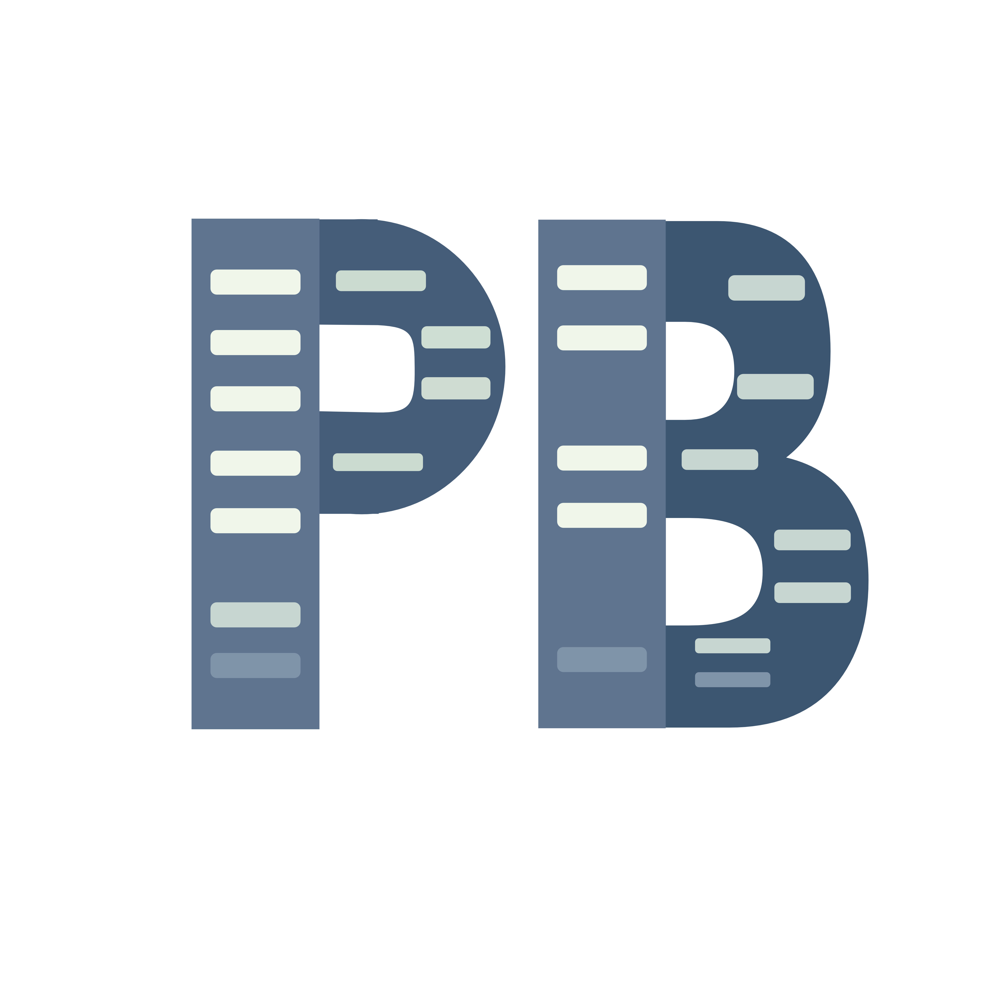
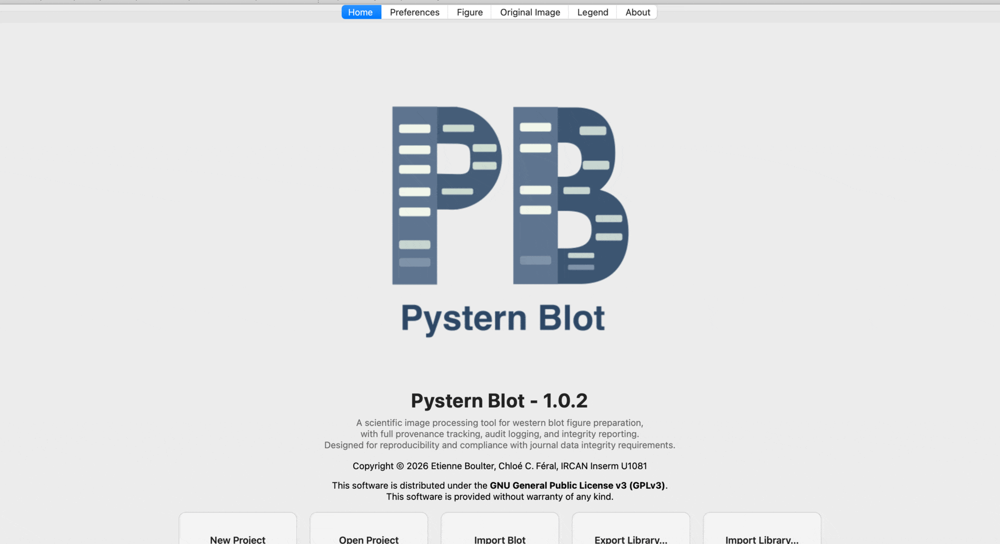

<p align="center">
  
</p>

# Pystern Blot

**Assemble publication-ready Western blot figures — with scientific integrity built in.**

[](https://doi.org/10.5281/zenodo.20185279)
[](https://www.gnu.org/licenses/gpl-3.0)
[](https://www.python.org)
[]()
[](https://pypi.org/project/pysternblot/)

→ **[Quick Start](QUICKSTART.md)** — get up and running in 5 minutes

---

## What it is

Western blot figures typically go through Photoshop for levels adjustments, then Illustrator for layout and annotation — a multi-step process with no record of what was changed or when. Pystern Blot replaces that pipeline with a single desktop application that handles everything from raw image import to final figure export. Both ECL and NIR fluorescence modalities are supported.

All processing stays in 16-bit throughout, so no dynamic range is lost when you adjust contrast. Every crop, rotation, and levels change is logged with SHA256 checksums of the original files, giving you a complete provenance record you can attach to a submission.

---

## Key features

- **True 16-bit pipeline** — images never get silently downsampled to 8-bit at any step
- **8-bit TIFF support** — legacy 8-bit images (grayscale, palette, and RGB modes) are accepted with a mandatory quality warning on import; bit depth is recorded in the integrity report and flagged at export; JPEG is explicitly rejected (lossy compression alters pixel values, not suitable for quantitative figures)
- **ECL and NIR fluorescence western blot support** — Typhoon dual-channel (685 nm / 785 nm), per-channel display settings, levels, invert, flip, rotation
- **Per-channel greyscale rendering in final figure** — each NIR channel appears as an independent row
- **Per-band wavelength routing for NIR ladders** — Show 685 / Show 785 per band in ladder presets
- **Shared crop template with per-channel independent crop for NIR** — resize once and all blots follow; per-channel override available for NIR
- **Inkscape-style crop handles** — grab a corner to resize width and height simultaneously; grab an edge midpoint to resize one dimension only; hit zones are larger than the visual handle so you don't need to be pixel-perfect
- **Levels, gamma, invert, 90° rotation, horizontal/vertical flip** — all non-destructive, per channel for NIR; Black and White values are directly editable as well as slider-adjustable
- **Dynamic levels range** — slider and input fields automatically adapt to the source bit depth (0–255 for 8-bit, 0–65535 for 16-bit)
- **Editable levels fields** — Black and White values can be typed directly (e.g. type 150 and press Enter) as well as adjusted via slider; both controls stay in sync
- **Overlay protein ladder with per-band wavelength assignment** — Show 685 / Show 785 checkboxes per preset band; ticks and labels appear automatically in the final figure
- **Include / exclude per blot and per NIR channel** — import multiple exposures or channels and choose which appear in the final figure without deleting the others
- **Library archive** — export and import `.pbarchive` files for lab handover / long-term storage, with SHA256 integrity verification of every asset
- **Project archiving** — soft-hide projects from the library without deleting them; restore at any time via the archive manager dialog or the right-click context menu on any project
- **Antibody name field per blot** — persisted in project file and audit log
- **Integrity report** — one-click export of a JSON or HTML report with SHA256 hashes, operation log, and crop/rotation metadata for every blot
- **Export to SVG, PDF, PNG, and 16-bit TIFF** — SVG and PDF preserve text as editable objects for final tweaks in Illustrator or Affinity Designer
- **DNA gel support** *(coming soon)* — the same integrity pipeline extended to agarose gel electrophoresis, with DNA ladder annotation and band tracking

---

## Supported image formats

| Format | Accepted | Notes |
|---|---|---|
| 16-bit grayscale TIFF | ✅ Recommended | Full dynamic range, no warnings |
| 8-bit TIFF (L, P, RGB modes) | ✅ With warning | Mandatory acknowledgement on import; flagged in integrity report and at export; not recommended for quantification |
| JPEG / JPG | ❌ Rejected | Lossy compression alters pixel values; not suitable for quantitative figures |
| PNG (8-bit) | ✅ With warning | Same 8-bit policy as TIFF |

---

## Screenshots

<p align="center">
  
</p>

---

## Requirements

- Python ≥ 3.10
- PySide6 ≥ 6.6
- Pydantic ≥ 2.0
- NumPy
- Pillow ≥ 10.0
- scikit-image

> **Note:** requirements only apply to the source/PyPI install methods. Standalone ports bundle everything.

---

## Installation

### Option 1 — PyPI

```bash
pip install pysternblot
python -m pysternblot
```

### Option 2 — From source *(all platforms)*

```bash
git clone https://github.com/TheBrickalista/PysternBlot.git
cd PysternBlot
python -m venv .venv
source .venv/bin/activate        # macOS / Linux
# .venv\Scripts\activate         # Windows
pip install -e .
python -m pysternblot
```

### Option 3 — Standalone app *(macOS and Windows)*

No Python required. Download the latest build for your platform directly from the **[Releases page](https://github.com/TheBrickalista/PysternBlot/releases/latest)**.

- **macOS:** download `PysternBlot-vX.X.X-macOS.zip`, unzip and open `PysternBlot.app`
- **Windows:** download `PysternBlot-vX.X.X-Windows.exe` and run it

---

**Workspace location:**
- macOS: `~/.pysternblot/`
- Windows: `C:\Users\<username>\.pysternblot\`

---

## Project structure

```
pysternblot/
├── models.py               — Pydantic data model (Project, Panel, Blot, BlotChannel, …)
├── storage.py              — Workspace I/O, asset import, archive export/import, Typhoon NIR import
├── render.py               — QGraphicsScene builders for final figure and provenance view
├── image_utils.py          — 16-bit and 8-bit image pipeline; bit-depth detection helpers; multichannel TIFF loading and encoding detection
├── integrity.py            — SHA256 provenance and integrity report generation; 8-bit source flagging
└── ui/
    ├── main_window.py          — Main window, tab layout, display controls; levels sliders adapt to bit depth; Black/White fields are editable QLineEdit
    ├── project_io_mixin.py     — Project create/open/import, library archive export/import, project archiving (soft-hide and restore)
    ├── marker_set_mixin.py     — Protein ladder preset editor (Show 685/785 per band)
    ├── overlay_ladder_mixin.py — Ladder assignment and kDa annotation
    ├── export_mixin.py         — PNG/PDF/SVG/TIFF/integrity report export; pre-export 8-bit warning
    ├── nir_import_dialog.py    — NIR blot import dialog (1 or 2 channel Typhoon)
    ├── legend_tab.py           — Legend editor tab
    ├── widgets.py              — Shared UI widgets
    ├── zoomable_graphics_view.py — Zoomable/pannable graphics view
    └── crop_rect_item.py       — Interactive crop rectangle with Inkscape-style corner and edge handles; generous hit zones for precise grab
tests/                      — pytest test suite (210 tests, plus 2 skipped pending LI-COR Odyssey sample file, covering models, rendering, provenance, archive integrity, 8-bit pipeline, and crop handle behaviour)
```

> The test suite is run on every commit and covers models, rendering, provenance, archive integrity, 8-bit pipeline, and crop handle behaviour.

---

## Supported instruments

| Instrument | Type | Import |
|---|---|---|
| Any ECL imager (ChemiDoc, ImageQuant, etc.) | Single-channel 16-bit TIFF | Import Blot… |
| Cytiva Typhoon | NIR fluorescence, dual-channel | Import NIR Blot… |
| LI-COR Odyssey | NIR fluorescence, dual-channel | Planned |
| Any agarose gel imager | DNA gel (grayscale TIFF) | Coming soon |

---

## Roadmap

Pystern Blot is under active development. Completed phases include the full export system, protein ladder system, NIR fluorescence support, library archive, project archiving, 8-bit image support, and experimental metadata fields. Upcoming work includes structured figure composition, LI-COR Odyssey support, DNA gel mode, and repository/ELN integration. See [pysternblot/Roadmap.md](pysternblot/Roadmap.md) for the full plan.

---

## Data Safety & Disclaimer

**Always preserve your original files.** Pystern Blot is a non-destructive pipeline — it never modifies source images — but no software is a substitute for proper data archival. Before working with any blot image, ensure your originals are backed up independently (institutional storage, external drive, cloud backup) and remain accessible outside of Pystern Blot.

> **Disclaimer:** Pystern Blot is provided as-is, without warranty of any kind. The authors accept no responsibility for any loss, degradation, corruption, or destruction of image data or experimental records arising from the use of this software. You are solely responsible for maintaining independent backups of your original files and raw data.

---

## License

Copyright © 2026 Etienne Boulter, Chloé C. Féral — IRCAN Inserm U1081.
Released under the [GNU General Public License v3.0](LICENSE).
